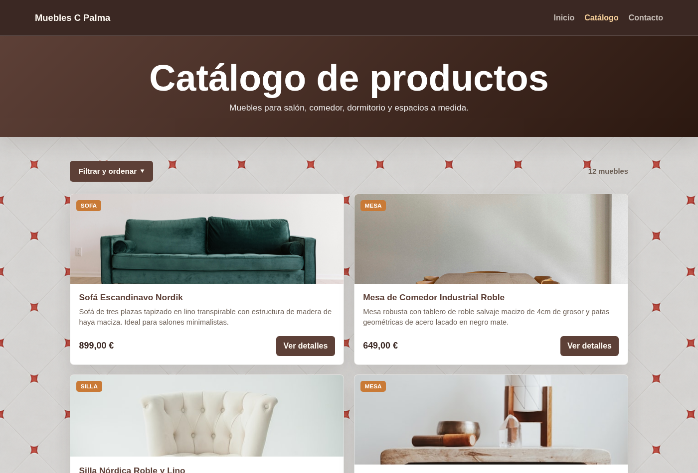
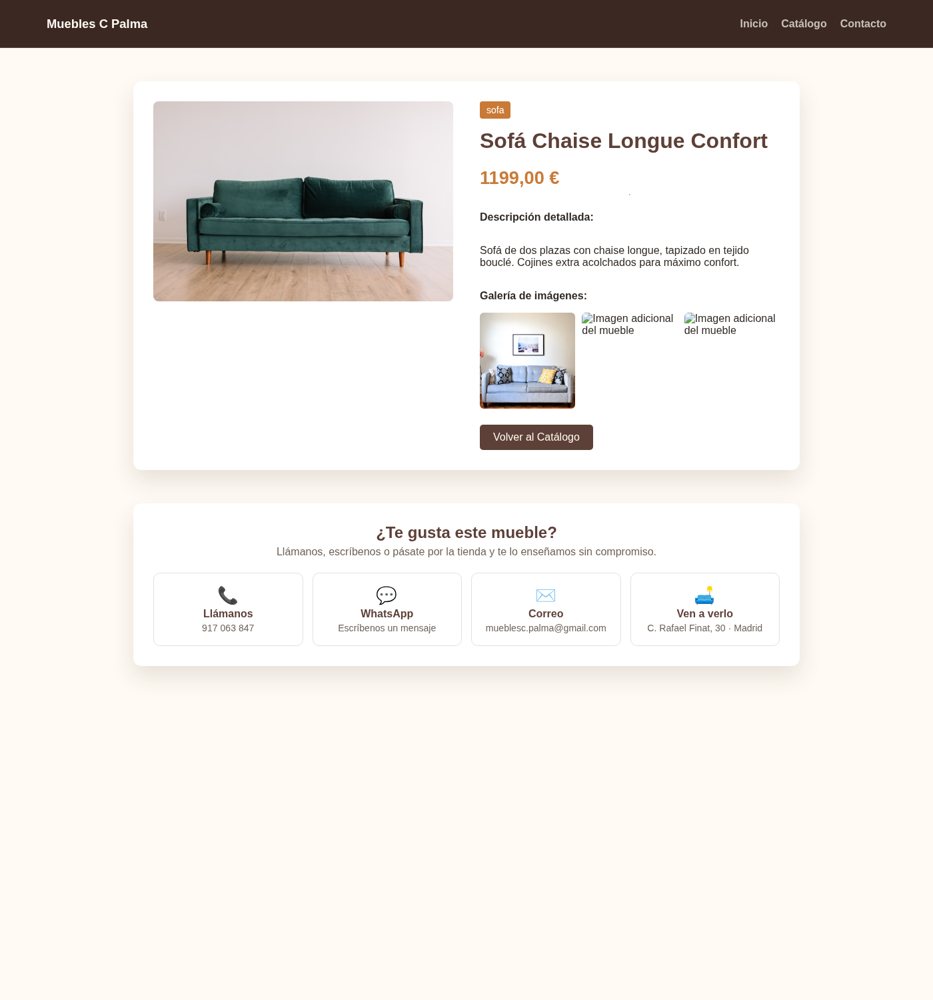
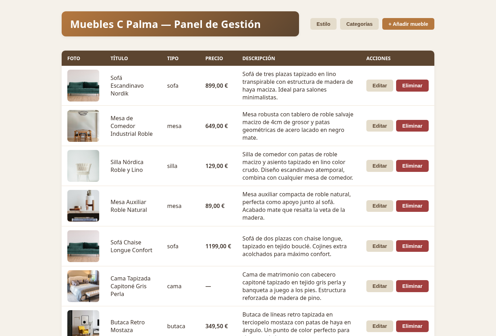

# Muebles C Palma

Aplicación web completa para una tienda de muebles real de Madrid: web pública con catálogo consultable por los clientes y panel de administración privado desde el que la tienda gestiona su inventario sin tocar código.




## Características

**Web pública** (HTML, CSS y JavaScript sin frameworks)

- Catálogo con búsqueda por texto (insensible a acentos), filtro por categoría y ordenación por título o precio, todo en cliente sobre una única carga de datos.
- Ficha de producto con galería de imágenes, precio (o "consultar precio" si no está publicado) y sección de contacto con enlaces de llamada, WhatsApp y correo que incluyen automáticamente el nombre del mueble.
- Páginas de inicio y contacto con mapa integrado.

**Panel de administración** (React + Vite)

- Acceso restringido con usuario y contraseña, y cambio de contraseña desde el propio panel.
- CRUD completo de muebles: título, categoría, precio, descripción, foto principal y galería de fotos adicionales con subida de archivos.
- Gestión de categorías y selector de tema visual del panel.

**API REST** (Spring Boot)

- Lectura pública del catálogo; toda operación de escritura exige autenticación HTTP Basic contra la base de datos (contraseñas con hash BCrypt).
- Entidades JPA validadas contra el esquema real de MySQL (`ddl-auto: validate`).
- Configuración por variables de entorno y perfil `prod` separado.

## Arquitectura

```
                        ┌──────────────────────────────┐
        :80             │            nginx             │
  cliente ────────────► │  /        web pública        │
                        │  /admin/  panel React        │
                        │  /assets/ imágenes           │
                        │  /api/ ─────────┐ proxy      │
                        └─────────────────┼────────────┘
                                          ▼
                                ┌──────────────────┐      ┌───────────┐
                                │  API Spring Boot │ ───► │  MySQL 8  │
                                │      :8080       │ JPA  │ (volumen) │
                                └──────────────────┘      └───────────┘
```

En producción todo se sirve bajo un único dominio: nginx entrega los estáticos y hace de proxy inverso de la API, y las imágenes subidas desde el panel se comparten entre la API y nginx mediante un volumen.

## Estructura del repositorio

```
├── backend/               API REST (Spring Boot 3, Java 21, Maven)
├── frontend-public/       Web pública (HTML/CSS/JS vanilla)
├── frontend-admin/        Panel de administración (React 18 + Vite)
├── infrastructure/
│   ├── docker/            Compose de desarrollo y de producción, init SQL
│   └── nginx/             Configuración del proxy inverso
└── docs/                  Capturas de pantalla
```

## Puesta en marcha (desarrollo)

Requisitos: Docker, Java 21, Node 20 y Python 3 (para servir la web pública).

```bash
# 1. Base de datos (crea el esquema y datos de ejemplo la primera vez)
cd infrastructure/docker && docker compose up -d

# 2. API - http://localhost:8080
cd backend && ./mvnw spring-boot:run

# 3. Web pública - http://localhost:3000
cd frontend-public && python3 -m http.server 3000

# 4. Panel de administración - http://localhost:5173
cd frontend-admin && npm install && npm run dev
```

Credenciales iniciales del panel: `admin` / `admin2026` (usuario de ejemplo del script de inicialización; cámbiala desde el propio panel en el primer acceso).

## Despliegue en producción

El stack completo se construye y levanta con Docker Compose:

```bash
cd infrastructure/docker
cp .env.example .env      # rellenar contraseñas
docker compose -f docker-compose.prod.yml up -d --build
```

Esto compila la API (build multi-etapa de Maven sobre JRE Alpine, ejecutada como usuario sin privilegios), genera el bundle del panel con Vite y publica la aplicación en el puerto 80 con MySQL accesible únicamente desde la red interna. Para servirla bajo HTTPS basta con poner delante un proxy con certificado (Caddy, Traefik o el propio nginx del hosting).

## API

| Método | Ruta                        | Auth | Descripción                          |
|--------|-----------------------------|------|--------------------------------------|
| GET    | /api/v1/muebles             | No   | Catálogo (filtro opcional `?tipo=`)  |
| GET    | /api/v1/muebles/{id}        | No   | Detalle de un mueble                 |
| POST   | /api/v1/muebles             | Sí   | Crear mueble                         |
| PUT    | /api/v1/muebles/{id}        | Sí   | Actualizar mueble                    |
| DELETE | /api/v1/muebles/{id}        | Sí   | Eliminar mueble                      |
| POST   | /api/v1/muebles/{id}/fotos  | Sí   | Añadir foto a la galería             |
| GET    | /api/v1/categorias          | No   | Listar categorías                    |
| POST   | /api/v1/categorias          | Sí   | Crear categoría                      |
| DELETE | /api/v1/categorias/{id}     | Sí   | Eliminar categoría (409 si está en uso) |
| POST   | /api/v1/uploads             | Sí   | Subir imagen                         |
| GET    | /api/v1/auth/me             | Sí   | Comprobar credenciales               |
| PUT    | /api/v1/auth/password       | Sí   | Cambiar contraseña                   |

## Capturas

| Ficha de producto | Panel de gestión |
|---|---|
|  |  |

## Autor

Desarrollado por [EloRC4](https://github.com/EloRC4).
